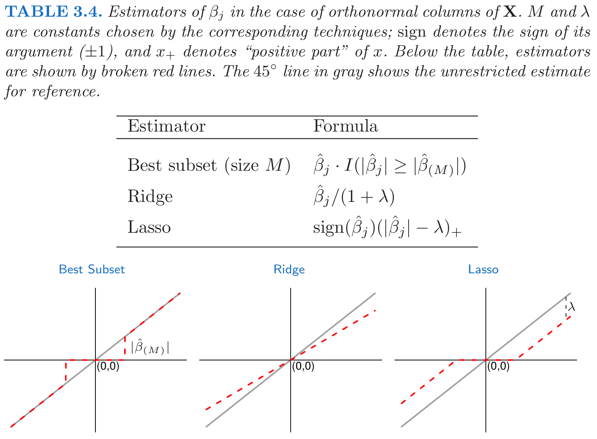
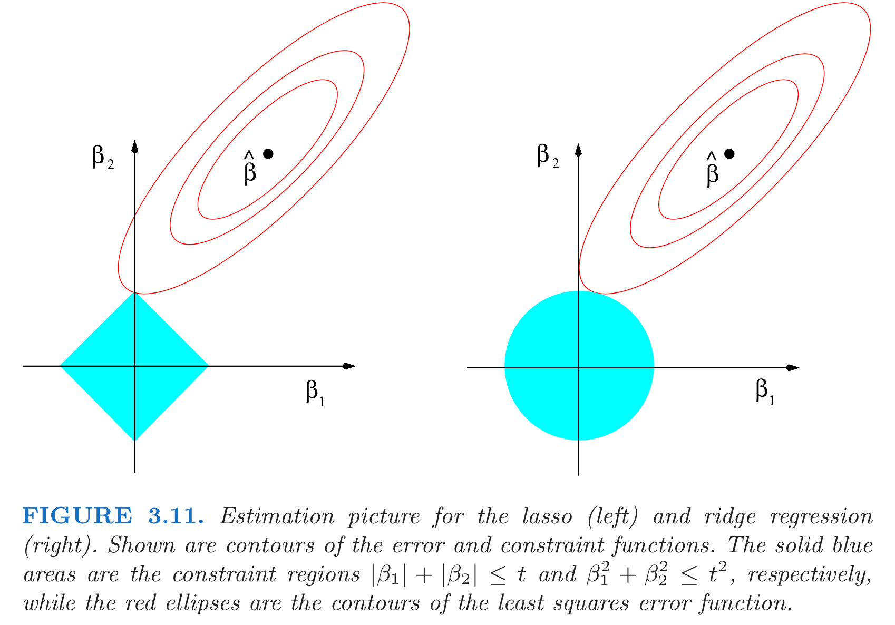
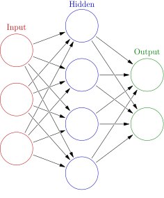
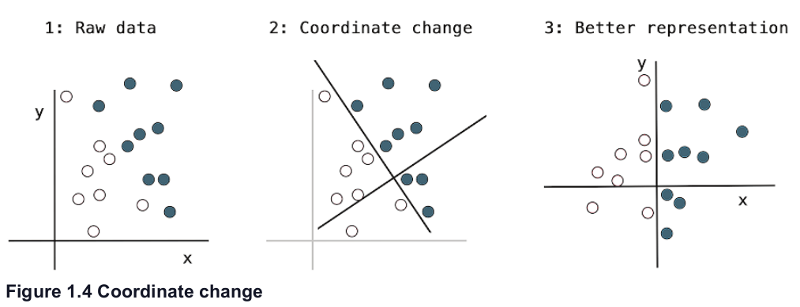
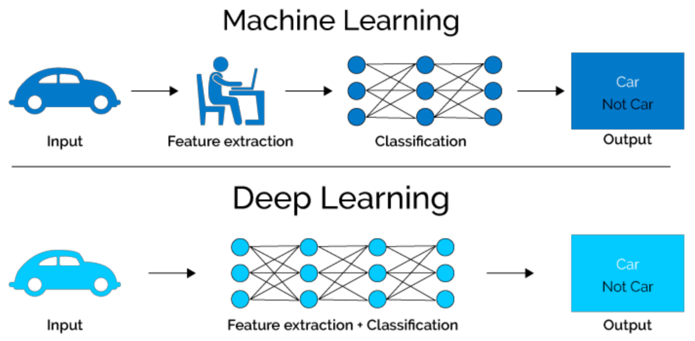
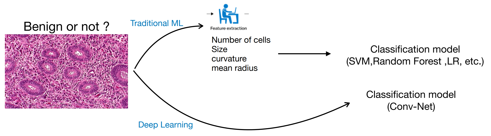
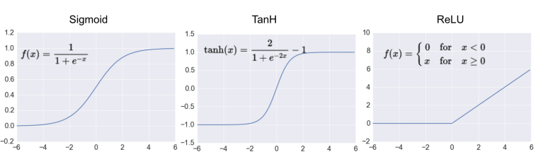
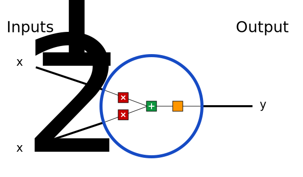
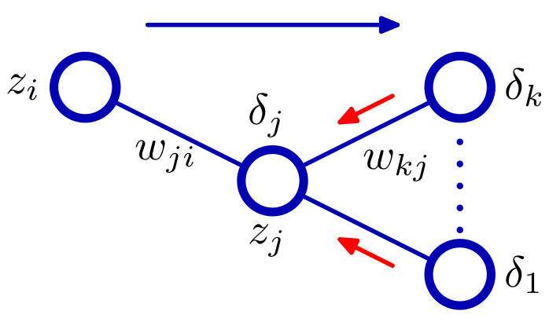
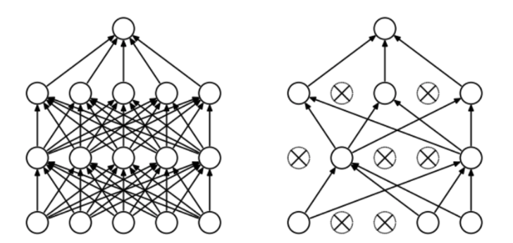

# El problema

* Tenemos disponibles datos con múltiples observaciones:
   
   * ejemplos (*examples*)
   * muestras (*samples*)

--

* Varias variables por observación, $x$:
  
  * predictores
  * atributos (*atributes*)
  * características (*features*)
  * covariables (*covariates*)
  * variables independientes
  * variables explicativas

--

* Una de ellas es de especial interés, $y$: 
  
  * variable respuesta
  * variable dependiente
  * objetivo (*target*)
  * salida (*output*)
  * etiqueta (*label*)
  
---

## Objetivos

  1. Obtener información sobre la **relación de asociación** entre las covariables y la variable dependiente  (**inferencia**)
  
    * ¿Qué variables influyen en la respuesta?
    * ¿Cuánto cambia la respuesta frente a un cambio en una covariable?
    * ...
    
  2. Predecir el valor de la variable respuesta para nuevas observaciones (**inferencia predictiva**)

  3. ¿Causalidad?


???

Información sobre la relación, por ej: qué variables son más relevantes

---

## Tipos de problemas

  1. Regresión, si $y \in \mathbb{R}^d$
  
  2. Clasificación, si la variable respuesta toma valores en un conjunto discreto no ordenado
  
  3. Otros: 
    
    * $y \in \mathbb  Q$
    
    * $y$ toma valores en un conjunto discreto ordenado
  
---

## Enfoque probabilístico

  1) **Modelización**: variable respuesta (dadas las covariables) es muestra iid de una distribución de probabilidad determinada, $p(y \vert x, w)$, parametrizada con $w$.
  
  2) **Estimación**: Dado un conjunto de entrenamiento $S = \{y_i, x_i\}_{i=1}^n$
  encontrar los "mejores" valores de $w$. Dos enfoques:
  * Frecuentista, maximizar verosimulitud
  $$
  w^* = \arg\max_{w}  \prod_i p(y_i \vert x_i, w)
  $$
  * Bayesiana, modelizar incertidumbre sobre los parámetros con un prior, y calcular posterior (dados los datos de entrenamiento)
  $$
  p(w | S) = \frac{p(S \vert w) p(w)}{p(S)}
  $$
  
  
---

## Enfoque probabilístico

  3) **Predicción**: dado un nuevo vector de covariables $x$, asignar un valor de respuesta $y$. Idea:
  
  $$
  y^* = \int u(y_D, y) p(y \vert x) dy
  $$
  
  * Ejercicio: ¿Cómo se calcula $p(y \vert x)$ en el paradigma Bayesiano?
  
  
  
---

## Regresión Lineal

Dado el conjunto de entrenamiento $S = \{y_i, x_i\}_{i=1}^n$


* Agrupamos todos los ejemplos de entrada $x_i$ en una matrix $\mathbf{X}$ de tamaño $n \times d$

* Agrupamos todas las salidas en un vector columna $y$ de tamaño $n \times 1$


Modelo $y \sim \mathcal{N} (w^T x, \sigma^2)$

Estimador de máxima verosimilitud:  $$\min_w\, ||y - \Xbf w||_2^2$$
Demuéstralo.


---
## Regresión Lineal

Gradiente: $$\nabla_w ||y - \Xbf w||_2^2 = 2\mathbf{X}^T(y - \mathbf{X}w) = \mathbf{X}^Ty - \mathbf{X}^T\mathbf{X}w$$

Minimizamos: $$\nabla_w ||y - \Xbf w||_2^2 = 0\quad \Rightarrow \quad  w^* = (\mathbf{X}^T\mathbf{X})^{-1} \mathbf{X}^T y$$

Recuperamos mínimos cuadrados ordinarios!


---
## Regresión Logística


* La salida $y$ es discreta, $y \in \{ 0, 1 \}$


* Modelo, $y$ sigue una distribución de Bernoulli con parámetro $p$ tal que
$$
p = \sigma(w^T x) = \frac{1}{1 + \exp(-w^T x)}
$$

* Estimador de máxima verosimilitud

$$\min_w \left[ -\sum_i y_i \log(\sigma(w^T x_i)) + (1-y_i) \log(1 -\sigma(w^T x_i)) \right] $$
Demuéstralo.

* Resolución Numérica
???

La función de pérdida log-loss es un poco distinta a como la vimos antes
  * Tiene un menos delante, porque queremos minimizar y no maximizar la verosimilitud
  * Propiedad de la función sigmoidea $\sigma(-x) = 1 - \sigma(x)$

---

## Generalized linear models (GLM)

* Generalización de la regresión lineal con otras distribuciones de la familia exponencial

* Componentes:
  
  * Distribución de $y$ con media $\mu$
  * Predictor lineal, $$g(\mu) = w^T x$$ donde $g(\cdot)$ es la función de media

* La función de media proporciona la relación entre la media de la distribución y el predictor lineal

* El inverso de la función de media, $g^{-1}(\cdot)$ se conoce con el nombre de **función de enlace**

---

##Ejemplo: Regresión logística

¿Cuál es su distribución y función de enlace?

???

* La función de enlace es la inversa de la anterior,

$$w^T x_i = g(\mu) = \ln\left(\frac{\mu}{1 - \mu}\right)$$

---

## Ejemplo: distribución de Poisson

* Esta distribución está indicada cuando queremos modelizar conteos

* Función de media

$$\mu = \exp(w^T x_i)$$

* Función de enlace

$$w^T x_i = \ln(\mu)$$

* Otras distribuciones posibles son la Gamma, Exponencial, Multinomial, etc.

---

## GLMs en R

* La función para ajustar modelos lineales generalizados es `glm()`

* Tiene los mismos argumentos principales que `lm()`, pero además tenemos que especificar la distribución de la variables dependiente con el parámetro `family`

* Por defecto se usa la función de enlace "canónica", pero esto se puede modificar (ver ayuda)

* Implementa el algoritmo IRLS (Newton-Raphson), que se puede generalizar para cualquier GLM cuya distribución pertenece a la familia exponencial

Ejemplo: regresión logística

```{r message=FALSE, warning=FALSE}
library(MASS)
fit <- glm(type ~ ., data=Pima.tr, family=binomial)
```

---

## Problemas (entre otros)

  * Poca flexibilidad (Sesgo grande), pues asumimos linealidad
  
  * Se puede solventar complicando el modelo (a mano) pero...
  
  * ... esto puede incrementar la varianza.
  
  * Trade-off

---

## Regularización

* Regular el trade-off utilizando un parámetro de control

* Regresión *ridge* (*MSE* + regularización $l_2$): $$\min_w\, ||y - \Xbf w||_2^2 + \lambda ||w||_2^2$$


---

## Lasso: formulación

* Problema optimización: $$\min_w\, || y - \Xbf w ||_2^2\quad \text{s.t. }\; ||w||_1 \leq t$$

* Equivalente: $$\min_w\, || y - \Xbf w ||_2^2 + \lambda ||w||_1$$

* $\lambda$ o $t$ son hiper-parámetros

  * $\uparrow \lambda$ o $\downarrow t$, se reducen los coeficientes (más regularización)

  * $\downarrow \lambda$ o $\uparrow t$, aumentan los coeficientes (menos regularización)
  
* $t$ suficientemente pequeño (o $\lambda$ suficientemente grande), algunos coeficientes = 0

---


## Lasso: motivación


* Regresión *ridge*: 

  * 

  * 


* Lasso:

  * 
  
  * 

???

Modelos seleccion: variables entran o salen del modelo


---

class: middle, center



???

$X^T X = I$, no ocurre en la practica pero interesante para ver la diferencia entre los estimadores

---

class: middle, center




---

## Interpretación Bayesiana

* Regularización = distribución a priori de los parámetros $w$

* Ridge regressión: distribución Normal

* Lasso: distribución de Laplace, $\tau = 1/\lambda$ $$f(w) = \frac{1}{2\tau} \exp\bigg(-\frac{|w|}{\tau}\bigg)$$

* Estimador: máximo de la distribución a posteriori (MAP)
  
* Demuéstralo

---

## Nota

* Lasso (Elastic Net) suelen hacer referencia a: minimizar MSE + norma $l_1$ (+ norma $l_2$)

* MSE puede reemplazarse por otras funciones de pérdida

* Por ej. cualquier GLM

* En esos casos hablamos de regresión logística, Poisson, Gamma + regularización Ridge/Lasso/Elastic Net


---

class: middle, center, inverse
# Redes Neuronales

---

## Problemas (hasta ahora)

* Para resolver hipótesis lineal: metemos variables a mano (*feature engineering*)

* Queremos que **aprender** las covariables relevantes (representaciones)

* Esperamos que en este nuevo espacio el problema de aprendizaje sea más sencillo


* Crear nuevas variables es, típicamente:

  1. critico para obtener buen rendimiento
  
  2. muy dependiente del problema
  
* Ejemplo: extraer variables de datos no tabulares (audio, video, imágenes, texto)

???
* Añadimos una capa intermedia (capa oculta)

.center[


[Fuente](https://en.wikipedia.org/wiki/Artificial_neural_network)
]


---

class: center, middle



---

## RN vs otros modelos
  
* Automatizan la creación de nuevas variables

* Esto simplifica la resolución de nuevos problemas:
  
  1. no necesario tanto conocimiento específico 
  
  2. proceso mucho menos costoso que crear nuevas variables a mano
  
* Además la creación de estas nuevas representaciones forma parte del aprendizaje

  * específicas para la tarea a resolver $\Rightarrow$ mejor rendimiento
  
---

class: center, middle


  
---

## Ejemplo

* Clasificar imágenes médicas en sano/enfermo

* Antes: una parte importante del trabajo consistía en procesar las imágenes del microscopio para extraer características:

  1. segmentar células
  
  2. identificar núcleo
  
  3. etc.
  
* Redes neuronales profundas extraen automáticamente características **útiles para la tarea de clasificar**

.center[

]

---

class: middle, center, inverse
# Perceptrón multicapa

---

## Introducción

* Hasta ahora hemos visto modelos de regresión y clasificación que recibían como input combinaciones lineales de *funciones base*.

* Para que estos modelos resulten prácticos, debemos adaptar las funciones base a los datos.

* Idea: 

  1. Fijar el número de funciones base de antemano
  
  2. Darles forma paramétrica
  
  3. Aprender parámetros usando los datos.

* **Aprender la representación**.

* *Perceptrón multicapa* o *feed-forward neural network*.

---

## Perceptrón multicapa (1)

* ¿Cómo parametrizamos las funciones de base?

* Hasta ahora

\begin{equation}
y(x,w) = f \left( \sum_{j=1}^M w_j \phi_j(x) \right)
\end{equation}

* Siendo $f$ una **activación no lineal**.

* Objetivo: parametrizar $\phi_j(x)$ y aprender los parámetros.

* Idea de las NN: parametrizar $\phi_j(x)$ de la misma manera que $y(x,w)$.

---

## Perceptrón multicapa (2)

* MLP básico: 

  1. Construír $M$ combinaciones lineales del input $x_1, \dots, x_D$:
\begin{equation}
a_j = \sum_{i=1}^D w_{ji}^{(1)} x_i + w_{j0}
\end{equation}
  
  2. Transformar cada activación $a_j$ usando una función de activación **no lineal** y **diferenciable**: $z_j = h(a_j)$.
  
  3. Repetir 1 y 2, tantas veces como **capas ocultas** queramos en la red.
  
  4. Por último, en la capa de salida, las activaciones se transforman con una función de activación adecuada para producir los outputs $y_k$.

* Notación: $w_{ji}$ son *pesos*, $w_{j0}$ son *biases*, $a_j$ son *activaciones*.

---

## Perceptrón multicapa (3)

* **Ejercicio**: ¿Por qué las activaciones tienen que ser funciones no lineales diferenciables?

---

## Perceptrón multicapa (4)
  
* La función de activación de la capa de salida, dependerá de la naturaleza de los datos.

* Para problemas de regresión, la activación será la identidad $y_k = a_k$.

* Para clasificación binaria (output es una probabilidad) la activación será la sigmoide $y_k = \sigma(a_k)$.

* Para clasificación multiclase, usaremos la softmax.

\begin{equation}
\text{softmax}(a)_i = \frac{e^{a_i}}{\sum_k e^{a_k}}
\end{equation}


---

## Perceptrón multicapa (5)

* ¿Funciones de activación de capas intermedias?

* Históricamente, la sigmoide.

* Hoy en día, las más conocidas son la *REctifier Linear Unit (RELU)*, tangente hiperbólica y variantes.

<center>

</center>


---

## Perceptrón multicapa (6)

* Componiendo lo visto, obtenemos una NN de dos capas (e.g. con salida binarias)

\begin{equation}
y(w,x) = \sigma \left( \sum_{j=0}^M w_{j}^{(2)} h \left( \sum_{i=0}^D w_{ji}^{(1)} x_i\right) \right)
\end{equation}

* El proceso de evaluar esta función se denomina *forward propagation*.
.center[


[Fuente](https://victorzhou.com/blog/intro-to-neural-networks/)
]

---

## Perceptrón multicapa (7)

* Gráficamente...

<center>

</center>


---

## Teorema de aproximación universal

* Asumimos:

  - red neuronal feed-forward
  
  - una capa oculta
  
  - número de neuronas finito
  
  - algunas funciones de activación (por ej. sigmoidea)
  
* Aproxima cualquier función continua con precisión arbitrarea

* **Pero**: el número de neuronas necesario es exponencialmente grande


---

class: middle, center, inverse
# Perceptrón multicapa - Entrenamiento


---

## Regresión

* Asumiremos que el target $t$ sigue una distribución normal

\begin{equation}
p(t \vert y(x,w), \beta^{-1})
\end{equation}

* Donde la activación de la capa de salida es la identidad.

* Dado conjunto de entrenamiento $X = \lbrace x_1, \dots, x_N \rbrace$, $\boldsymbol{t} = t_1, \dots, t_N$, maximizar la verosimilitud es equivalente a

\begin{equation}
w_{ML} = \arg\min_w E(w) = \arg\min_w \frac{1}{2} \sum_{i=1}^N \lbrace y(x_n,w) - t_n\rbrace^2
\end{equation}

* Ojo: la **no linealidad** de la red hace que $E(w)$ no sea convexo... en la práctica conseguiremos converger a mínimo local.

* En regresión multi-target, se asume **independencia condicional** de los targets dados $x$ y $w$ y el análisis es idéntico.

---

## Clasificación binaria

* $t=1$ representa una pertenencia a una clase y $t=0$ a la otra. La NN tiene una única salida con activación sigmoide.

* Interpretamos $y(x,w)$ como $p(t=1 \vert x )$. Entonces 

\begin{equation}
p(t \vert x,w) = y(x,w)^t \lbrace 1-y(x,w) \rbrace^{1-t}
\end{equation}

* Dado conjunto de entrenamiento, maximizar la verosimilitud equivale a minimizar la **entropía cruzada**

\begin{equation}
E(w) = - \sum_{n=1}^N \lbrace t_n \log y_n + (1-t_n) \log (1-y_n) \rbrace
\end{equation}

* Para clasificación binaria **multi-etiqueta**, usamos una red con $K$ outputs sigmoidales. 

* Asumiendo independencia condiciones de las etiquetas dado el input, el análisis es idéntico.


---

## Clasificación multiclase

* Las $K$ posibles clases se escriben en notación One-Hot-Encoding.

* Si la observación $n$-ésima, pertenece a la clase 1, entonces $t_{n1}=1$ y $t_{nj} = 0$ para $j \neq 1$.

* La red tiene $K$ salidas interpretadas como $y_k(x,w) = p(t_{\cdot k} = 1 \vert x)$.

* Maximizar la verosimilitud equivale a minimizar

\begin{equation}
E(w) = - \sum_{n=1}^N \sum_{k=1}^K t_{nk} \log y_k(x_n,w)
\end{equation}

* La red tiene $K$ unidades de salida con activación softmax.

---

## Optimización

* Una vez definida la función de coste, hay que encontrar los pesos que la optimicen.

* $\nabla E(w) = 0$ no se puede resolver analíticamente. Tenemos que usar métodos numéricos iterativos.

* Los más importantes: **basados en el gradiente**, pues como veremos, evaluar el gradiente es muy eficiente gracias al algoritmo de *backpropagation*.

* Descenso por el gradiente requiere inicializar los pesos e iterar:

\begin{equation}
w^{t+1} = w^t - \eta \nabla E(w^t)
\end{equation}

* En cada iteración, accedemos a todos los datos para calcular $\nabla E(w^t)\dots$  complejidad $\mathcal{O}(N)$.

---


## Descenso por el gradiente estocástico (SGD)

* La función de coste tiene esta forma:

\begin{equation*}
E(w) = \sum_{i=1}^N E_i(w)
\end{equation*}

--

* En cada iteración, escogemos **un dato** al azar

\begin{equation*}
w^{t+1} = w^t - \eta_t \nabla_w E_i(w^t)
\end{equation*}


---


## Descenso por el gradiente estocástico (SGD)

* También podemos seleccionar un **minilote** $\mathcal{B}$

\begin{equation*}
w^{t+1} = w^t - \eta_t \nabla_w \frac{1}{B} \sum_{i \in \mathcal{B}} f_i(w^t)
\end{equation*}

* La complejidad pasa de $\mathcal{O}(N)$ a $\mathcal{O}(B)$, además, no es necesario tener toda la matriz $X$, sino solo los datos del minilote $\mathcal{B}$.

* Otra ventaja: mayor probabilidad de escapar óptimos locales que con GD, un punto estacionario de la función objetivo en GD no lo será en SGD generalmente.


---

## Descenso por el gradiente estocástico (SGD)

* Usando resultados de aproximación estocástica de Robbins & Monro (1954), se puede demostrar convergencia a mínimo local siempre y cuando

  1. Las tasas de aprendizaje cumplen estas condiciones:
\begin{align*}
\sum_{t=0}^\infty \eta_t &= \infty \\
\sum_{t=0}^\infty \eta^2_t &< \infty
\end{align*}

  2. El gradiente que se utiliza en cada iteración es un estimador **no sesgado** del gradiente.


---

## Eecto de la estocasticidad


---
class: middle, center, inverse
# Perceptrón muilticapa. Backpropagation

---
## Backpropagation (1)

* Técnica **eficiente** para evaluar $\nabla E(w)$ aprovechando la estructura de perceptrones multicapa.

* En mayoría de problemas $E(w) = \sum_n E_n (w)$, nos centramos en evaluar $\nabla E_n(w)$.

* En un MLP, cada unidad calcula combinación lineal de sus inputs $z_i$, $a_j = \sum_i w_{ji}z_i$.

* Como output devuelve $z_j = h(a_j)$.

--

* Supongamos que para cada instancia the train, hemos calculado inputs y outputs de todas las neuronas (*forward propagation*).

* Evaluamos la derivada de $E_n$ respecto $w_{ji}$

\begin{equation}
\frac{\partial E_n}{\partial w_{ji}} = \frac{\partial E_n}{\partial a_j} \frac{\partial a_j}{\partial w_{ji}} := \delta_j z_i 
\end{equation}

* Donde $\delta_j = \frac{\partial E_n}{\partial a_j}$.

---
## Backpropagation (2)

* Para calcular las derivadas, únicamente necesitamos calcular $\delta_j$ para cada unidad.

* Para cualquier unidad oculta, $E_n$ es función de $a_j$, únicamente a través de las $a_k$ de la capa siguiente.

\begin{equation}
\delta_j =  \frac{\partial E_n}{\partial a_j} = \sum_k \frac{\partial E_n}{\partial a_k} \frac{\partial a_k}{\partial a_{j}}
\end{equation}

<center>

</center>

---
## Backpropagation (2)

* Efectuando las derivadas vemos que

\begin{equation}
\delta_j =  h'(a_j) \sum_k w_{kj} \delta_k
\end{equation}

* Para unidad de salida calcular $\delta_j$ es trivial, e.g. $E_n = \frac{1}{2} (y_n - t_n)^2$, y la activación es la identidad, entonces 

\begin{equation}
\delta = y_n - t_n
\end{equation}

---
## Backpropagation (3)

* El algoritmo 

  1. Meter vector $x_n$ a la red y realizar el *forward pass* de la red, para calcular inputs y outputs en cada unidad.
  
  2. Evaluar $\delta$ en la unidad de salida.
  
  3. Propagar las $\delta$'s hacia atrás para obtener $\delta_j$ en cada unidad usando
\begin{equation}
\delta_j =  h'(a_j) \sum_k w_{kj} \delta_k
\end{equation}
  
  4. Evaluar las derivadas usando
\begin{equation}
\frac{\partial E_n}{\partial w_{ji}} = \delta_j z_i 
\end{equation}

---
## Backpropagation (4)

* Aspecto crucial de *backpropagation* es su eficiencia.

* Sea $W$ el número totad de pesos.

* Calcular el gradiente usando *backpropagation*, requiere $O(W)$ operaciones, para $W$ suficientemente grande.

* Esto es así, pues el número de pesos suele ser mucho mayor que el número de neuronas.

* Esto implica que el cuello de botella en la computación es evaluar las combinaciones lineales. La evaluación de las activaciones requiere menos carga, pues hay tantas activaciones como neuronas.

---
## Backpropagation (5)

* **Ejercicio**: ¿Cuál es la complejidad de evaluar la derivada usando diferencias centrales?
\begin{equation}
\frac{\partial E_n}{\partial w_{ji}} = \frac{E_n(w_{ji} + \epsilon) - E_n(w_{ji} - \epsilon)}{2 \epsilon} + O(\epsilon^2)
\end{equation}


---
class: middle, center, inverse
# Perceptrón multicapa. Regularización

---

## Regularización (1) 

* Número de unidades de input y output se eligen teniendo en cuenta la dimensionalida de los datos.

* Número de unidades ocultas $M$, es un hiperparámetro que regula la complejidad del modelo.

* Existirá un valor óptimo que equilibre entre underfitting y overfitting.

* Alternativa: escoger $M$ lo suficientemente grande, y añadir regularizadores:

  1. L2: $\lambda\Vert w \Vert_2^2$, conocido como *weight decay*.
  
  2. L1: $\lambda \Vert w \Vert_1$
  
---

## Regularización (2) 

* Otra alternativa es usar *early stopping*.

* Como entrenamos de forma iterativa, podemos observar el comportamiento de una estimación del error de generalización mientras vamos entrenando.

* Guardamos un conjunto de validación, y en cada época, calculamos el error producido en este conjunto de validación.

* Observaremos que el error primero decrece, y después, cuando se hace overfitting, crece.

* Dejaremos de entrenar antes de que esto último suceda.

* Esto, en algunos casos, es equivalente a reducir la complejidad efectiva de la red.

---

## Regularización (3)

* Otra alternativa es usar *dropout*.

* En cada ejemplo de cada iteración del entrenamiento, "apagar" cada neurona con probabilidad $1-p$.

* En cada iteración se entrena una red de tamaño efectivo menor.

<center>

</center>

